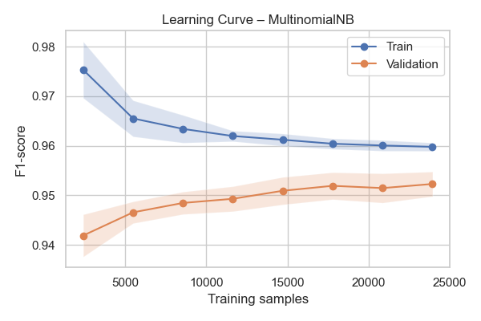
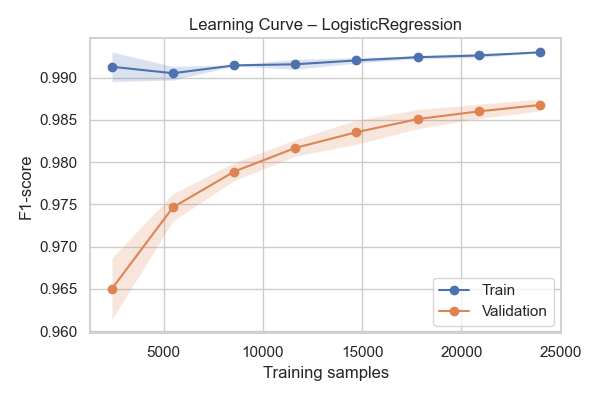
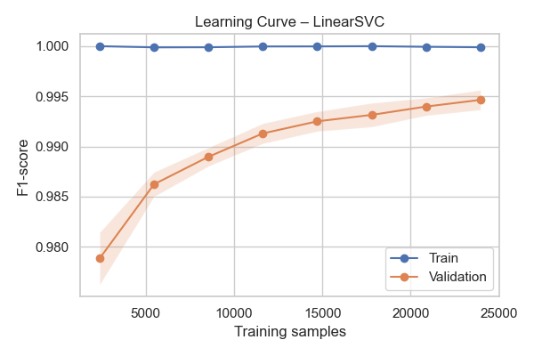
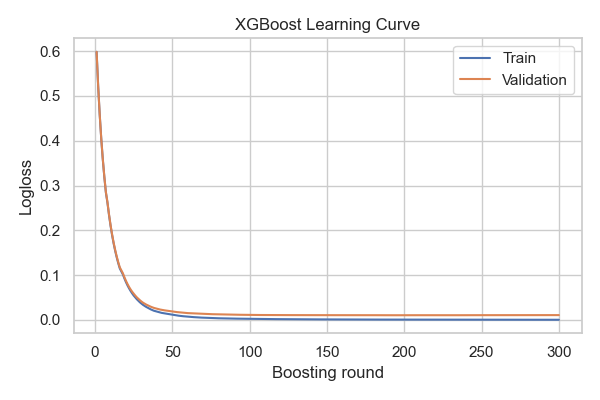

Learning curves
===============

This section visualises how model performance evolves with more training data (for linear models) and over boosting iterations (for XGBoost).

   MultinomialNB – train/validation F1 vs.~training-set size.

   Logistic Regression learning curve.

   LinearSVC learning curve.

   XGBoost log-loss across boosting rounds (train vs.~validation). 